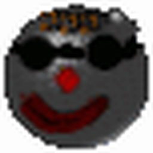

# ClanBomber — Nintendo Switch Homebrew Port



A homebrew port of [**ClanBomber2**](https://github.com/viti95/ClanBomber2) — the SDL2-based fork of the classic [Bomberman-style multiplayer game](https://www.nongnu.org/clanbomber/) by Andreas Hundt and Denis Oliver Kropp — to the Nintendo Switch via the [devkitPro](https://devkitpro.org/) toolchain.

Builds a `clanbomber.nro` runnable from the **Homebrew Menu** on a Switch with custom firmware (Atmosphère) or in an emulator such as Ryujinx / suyu. An optional NSP forwarder makes the game launchable from the Switch's home menu like a regular title.

## Status

Playable. Works in emulator and on real hardware.

- ✅ Boot to main menu, intro animation, audio
- ✅ Local multiplayer match playable end-to-end
- ✅ JoyCon / Pro Controller input (D-Pad, left analog stick, A/B/X/Y, Plus, Minus)
- ✅ NRO icon, custom title metadata
- ✅ NSP forwarder support (built externally — see below)
- ❌ Quit-to-menu crashes
- ❌ No online multiplayer (already removed in upstream)
- ❌ No on-screen keyboard yet for player name entry
- ❌ No Map Editor Support

## Prerequisites

1. **devkitPro** — install from <https://devkitpro.org/wiki/Getting_Started>. Default Windows path expected: `C:\devkitPro`.

2. **Switch SDL2 stack** via devkitPro's pacman:
   ```
   dkp-pacman -S switch-sdl2 switch-sdl2_image switch-sdl2_mixer switch-sdl2_ttf
   ```
   Pulls in transitive deps: `freetype`, `harfbuzz`, `libpng`, `libjpeg-turbo`, `libwebp`, `bzip2`, `zlib`, `libogg`, `libvorbisidec`, `libmodplug`, `mpg123`, `libopus`, `opusfile`, `flac`, `libdrm_nouveau`, `mesa`.

## Build

From a regular Windows `cmd` prompt at the repo root:

```
.\build.cmd
```

This sets `DEVKITPRO` / `DEVKITA64` / `PORTLIBS_PREFIX`, prepends the toolchain to `PATH`, and runs `make`. First invocation also stages the `romfs/` directory by copying assets (fonts, maps, pictures, sounds) from `upstream/src/` into it.

Output: **`clanbomber.nro`** (~13.5 MB with bundled assets).

To clean intermediate state:
```
.\build.cmd clean          REM removes build/ and *.nro
.\build.cmd clean-assets   REM removes romfs/
```

### Custom NRO icon

The Makefile auto-detects `icon.jpg` (256×256 JPEG) at the repo root and embeds it into the NRO's NACP. The shipped `icon.jpg` is generated from `icon.ico` at the repo root via a one-liner:

```powershell
powershell -NoProfile -Command "Add-Type -AssemblyName System.Drawing; $src = [System.Drawing.Image]::FromFile('icon.ico'); $dst = New-Object System.Drawing.Bitmap 256, 256; $g = [System.Drawing.Graphics]::FromImage($dst); $g.InterpolationMode = 'HighQualityBicubic'; $g.DrawImage($src, 0, 0, 256, 256); $dst.Save('icon.jpg', [System.Drawing.Imaging.ImageFormat]::Jpeg); $g.Dispose(); $dst.Dispose(); $src.Dispose()"
```

Replace `icon.ico` / `icon.jpg` with your own artwork to rebrand.

## Deploy

### Emulator (Ryujinx / suyu)

File → Load Application From File → pick `clanbomber.nro`. Configure Player 1 input mapping to your keyboard or controller in the emulator settings.

### Real hardware (Switch with Atmosphère CFW)

Copy the NRO to the SD card:

```
sdmc:/switch/clanbomber/clanbomber.nro
```

Boot into Homebrew Menu (album icon → press R) and select ClanBomber.

### Optional: NSP forwarder (home-menu tile)

For a real home-menu tile that looks like an installed game, build an NSP forwarder externally. The simplest path is the web-based generator at <https://nsp-forwarder.n8.io/> — point it at `sdmc:/switch/clanbomber/clanbomber.nro`, supply your console's `prod.keys`, pick a title ID in the user range (`0x0500_xxxx_xxxx_xxxx`), and an icon. Install the resulting NSP via Tinfoil / DBI / Awoo Installer.

The NSP is per-console (signed with your personal keys), so it isn't included in this repository.

## Controls

### Menu navigation
| Action | Input |
|---|---|
| Move selection | D-Pad or left analog stick |
| Confirm | A or Plus |
| Back | B |
| Toggle player on/off (Player Setup) | X |
| Toggle highlighting (Player Setup) | Y |

### In-game (per player using a JoyCon / Pro Controller)
| Action | Input |
|---|---|
| Move | D-Pad or left analog stick |
| Drop bomb | A or B |
| Quit to main menu | Minus |

`Plus` and `Minus` correspond to SDL `START` / `BACK` in the libnx HID mapping. Physical "A" is on the right (Nintendo convention) — confirm — and physical "B" is below — back. The translation lives in `src/switch_main.cpp` via an `SDL_AddEventWatch` that synthesises keyboard events for the existing menu loops.

## SD-card layout

Once launched, ClanBomber creates and uses:

```
sdmc:/switch/clanbomber/
├── clanbomber.nro            (the game binary you copied)
├── clanbomber.cfg            (player roster, settings)
├── clanbomber_net.cfg        (network config, mostly unused on Switch)
├── maps.disabled             (which maps are hidden, if any)
└── maps/                     (your own user maps, .map files)
```

Drop additional `.map` files into `maps/` — they show up in the Map Selector alongside the 33 maps bundled inside the NRO's RomFS.

## Repository layout

```
.
├── Makefile             Top-level Switch build rules (devkitPro)
├── build.cmd            Windows helper: sets DEVKITPRO and runs make
├── icon.ico, icon.jpg   App icon source + 256x256 build asset
├── LICENSE              GPLv2 license text
├── README.md            This file
├── src/
│   ├── config.h         Minimal autotools config.h replacement
│   └── switch_main.cpp  Switch entry point: romfsInit, controller→key
│                        translation event watch, hand-off to ClanBomber
└── upstream/            ClanBomber2 sources (GPLv2+) with the patches
                         listed below applied directly
```

## Upstream patches

The Switch port modifies the following files inside `upstream/src/`:

| File | What changed |
|---|---|
| `ClanBomber.cpp` | Wrap `int main()` in `#ifndef __SWITCH__` so our own entry point provides `main`. Skip explicit `SDL_Quit()` / `TTF_Quit()` / `Mix_CloseAudio()` in `~ClanBomberApplication()` on Switch (kernel reclaims resources cleanly; explicit teardown crashes audren). |
| `UtilsGetHome.cpp` | Add `__SWITCH__` branch returning `sdmc:/switch` so the upstream `GetXxxHome() / "clanbomber"` concatenation lands at `sdmc:/switch/clanbomber/`. |
| `Map.cpp` | Switch-specific path for `maps.disabled` (drops the hidden-dot prefix that doesn't make sense on FAT32). |
| `PlayerSetup.cpp` | On entry, coerce inherited keyboard/mouse/out-of-range-joystick controller selections to `AI`. In the controller-cycling step, skip `KEYMAP_1..3`, `RCMOUSE`, and `JOYSTICK_N` slots that have no physically-attached pad (probed via `SDL_IsGameController`). |
| `Menu.cpp` | Accept `SDL_SCANCODE_BACKSPACE` in addition to `ESCAPE` for "back" in the main menu, so the synthesized B-button event leaves menus without also exiting matches. |
| `Credits.cpp` | Same BACKSPACE alongside ESCAPE handling for the credits screen. |
| `Controller_Joystick.{cpp,h}` | Re-implemented on top of `SDL_GameController` (named buttons / standard mapping) instead of raw `SDL_Joystick`. Movement reads left analog stick **or** D-Pad; bomb fires on physical **A or B**. Falls back to raw `SDL_Joystick` for devices SDL doesn't recognise. |

All modifications are guarded by `#ifdef __SWITCH__` where they would otherwise change behaviour for upstream Linux builds.

## Known limitations

- Renderer pinned to `opengles2` — the only reliable backend on Switch via `mesa` / `libdrm_nouveau`.
- No on-screen keyboard for player name entry; the saved defaults (`Are`, `You`, `Still`, `Watching`, `AIs`, `Playing`, `For`, `You`) are kept until the user edits the config file manually.
- Localization disabled (`-DENABLE_NLS=0`) — gettext isn't wired up against RomFS yet. UI is English.
- The "Software was closed" dialog after Quit is normal Switch behaviour for any application that ends, including official games — **not** a crash. (A real crash would say "due to an error".)

## License

This port is a derivative work of **ClanBomber2** (GPLv2-or-later) by Andreas Hundt, Denis Oliver Kropp, René López, and the [`viti95/ClanBomber2`](https://github.com/viti95/ClanBomber2) maintainers. Per the GPL, the entire combined work — including the Switch-specific code in `src/` and the patches inside `upstream/` — is also distributed under **GPLv2-or-later**.

- Full license text: [`LICENSE`](LICENSE) at repo root (copy of upstream's `COPYING`).
- The bundled `DejaVuSans-Bold.ttf` font is licensed under the [DejaVu Fonts License](upstream/LICENSE.DEJAVU).

You are free to redistribute, modify, and republish under GPL terms. If you publish a derivative version, you must:

- Preserve the original copyright notices in modified source files
- Mark your changes (Git history is sufficient)
- Provide source code to recipients (a public Git repository satisfies this)
- License the combined work under GPLv2 (or any later GPL version)

## Credits

- **ClanBomber** original game: Andreas Hundt, Denis Oliver Kropp
- **ClanBomber2** SDL2 maintenance: René López and contributors
- **SDL2 fork** [`viti95/ClanBomber2`](https://github.com/viti95/ClanBomber2)
- **Switch port**: this repository
- **devkitPro** & **libnx** team — Switch homebrew toolchain
- **switchbrew** community — homebrew documentation
